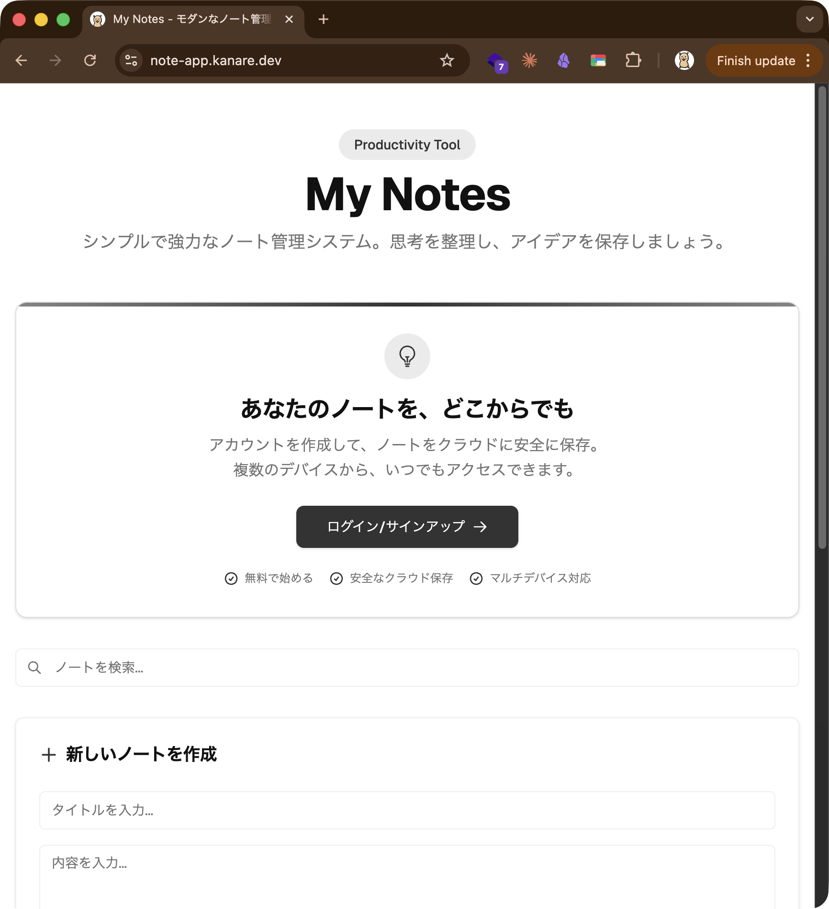
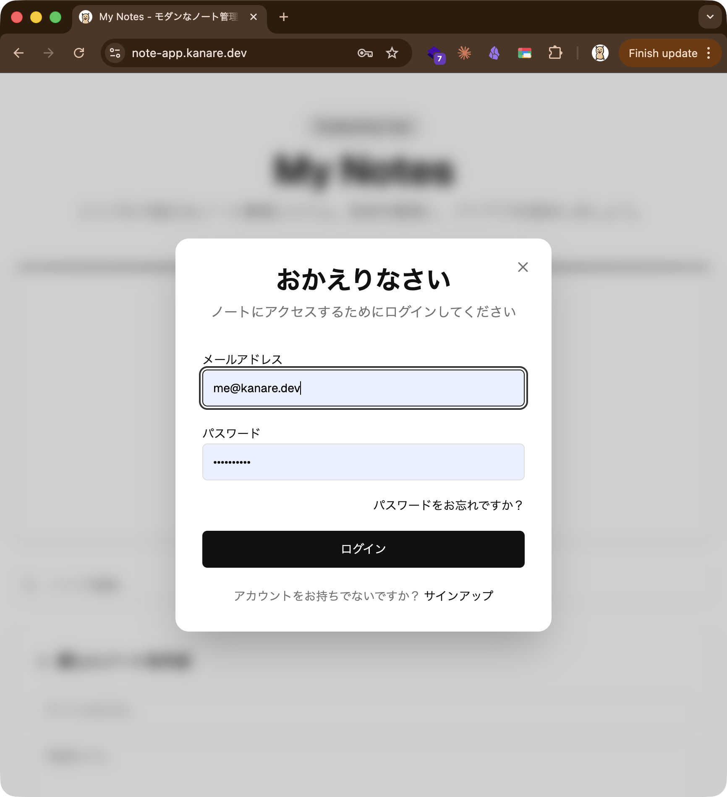
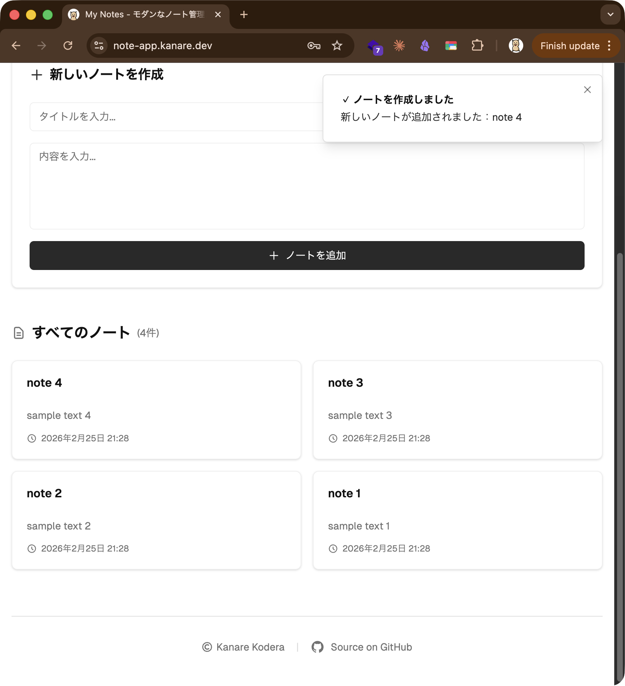
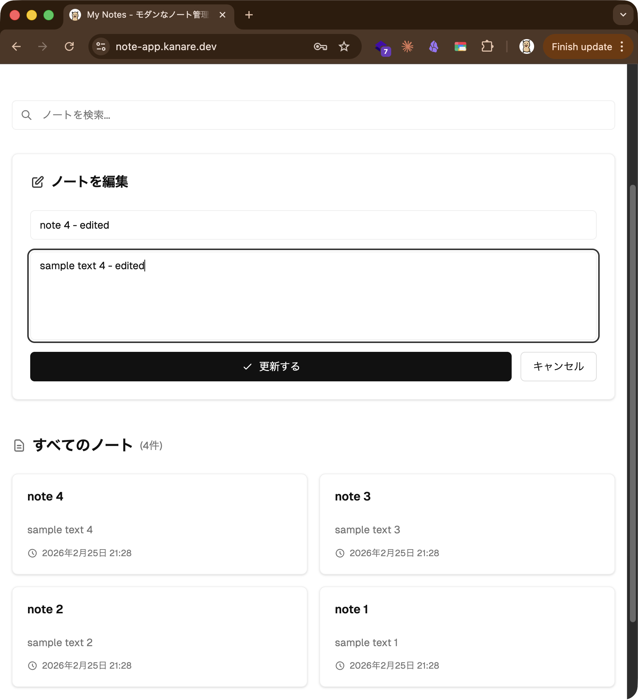
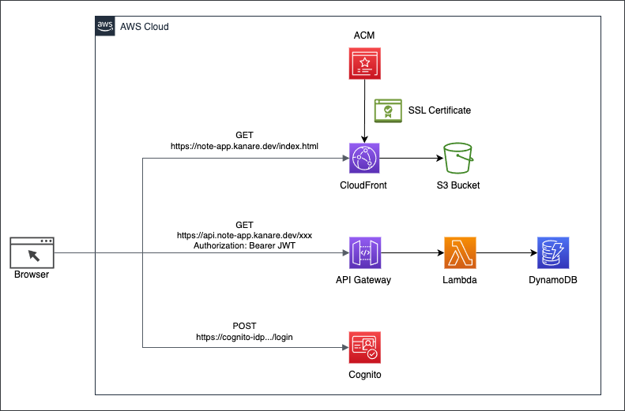
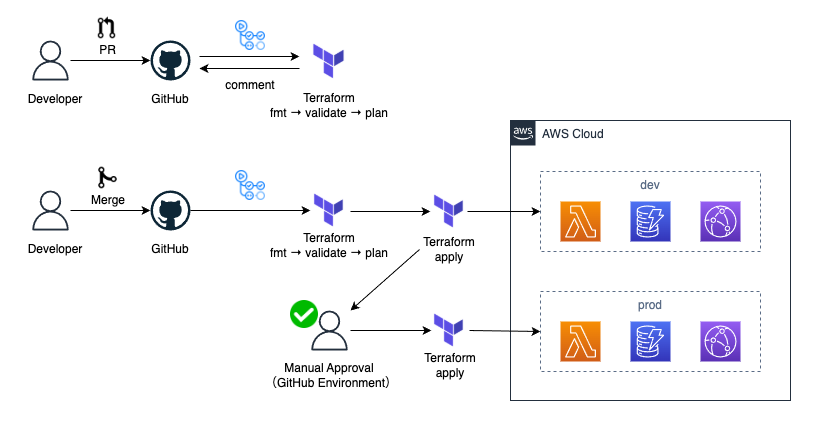

# Personal Notes App

[](https://github.com/Canale0107/tf-practice/actions/workflows/terraform.yml)
[](https://github.com/Canale0107/tf-practice/actions/workflows/deploy-static-site.yml)

AWS サーバーレス構成と Terraform IaC で構築した、認証付きメモ管理 Web アプリです。

**デモ**: [https://note-app.kanare.dev](https://note-app.kanare.dev)

---

## スクリーンショット

### トップ画面



### ログイン画面



### ノート一覧



### ノート編集



---

## 機能

- **認証**: Cognito によるサインアップ / サインイン / セッション管理
- **ノート管理**: 作成 / 一覧 / 詳細 / 更新 / 削除（CRUD）
- **Markdown 対応**: 本文は Markdown で記述可能
- **レスポンシブ UI**: Tailwind CSS によるモバイル対応

---

## 技術スタック

| カテゴリ | 技術 |
|----------|------|
| フロントエンド | React / TypeScript / Vite / Tailwind CSS |
| バックエンド | AWS Lambda (Python 3.11) / API Gateway |
| データベース | Amazon DynamoDB |
| 認証 | Amazon Cognito (JWT) |
| CDN / ホスティング | CloudFront / S3 |
| IaC | Terraform |
| DNS | Cloudflare |
| CI/CD | GitHub Actions |

---

## アーキテクチャ



```
ユーザー
  → CloudFront → S3（React SPA）
  → API Gateway（Cognito JWT 認証）→ Lambda → DynamoDB
```

### 環境分離

| 環境 | ドメイン | Terraform State |
|------|----------|-----------------|
| Production | note-app.kanare.dev | `s3://…/prod/terraform.tfstate` |
| Development | dev.note-app.kanare.dev | `s3://…/dev/terraform.tfstate` |

dev / prod は Terraform State を完全に分離し、相互に影響しない構成です。

---

## 技術的なポイント

### 1. インフラの完全 IaC 化

AWS リソース（CloudFront / S3 / API Gateway / Lambda / DynamoDB / Cognito / ACM）から Cloudflare DNS レコードまで、すべて Terraform で管理しています。`terraform destroy` → `terraform apply` で環境を完全再現できます。

### 2. Terraform モジュール設計

```
terraform/modules/
  ├── s3/          # 静的ホスティング
  ├── lambda/      # Lambda 関数
  ├── dynamodb/    # テーブル定義
  ├── api-gateway/ # REST API + Cognito 認可
  └── cognito/     # ユーザープール
```

モジュールを共通化し、dev / prod 環境は変数の差し替えのみで同じモジュールを利用します。

### 3. GitOps CI/CD パイプライン

インフラ変更を PR ベースで管理する GitOps フローを実装しています。

```
PR 作成:    fmt → validate → plan（dev + prod）→ PR コメントに差分表示
main マージ: fmt → validate → plan → apply dev（自動）
                                   → apply prod（GitHub Environment で手動承認）
```

prod への apply は GitHub Environment の Required Reviewers による承認が必要なため、意図しない本番変更を防止しています。

### 4. Cognito JWT 認証

API Gateway レベルで Cognito オーソライザーを設定し、未認証リクエストをすべて拒否します。Lambda は JWT の `sub` クレームからユーザー ID を取得し、自分のノートのみ操作できるよう制御しています。

---

## ローカル開発

### フロントエンド

```bash
cd frontend
npm ci
npm run dev        # localhost:5173
```

### 環境変数（`.env.development`）

```bash
VITE_API_BASE_URL=https://api-dev.note-app.kanare.dev
VITE_AWS_REGION=ap-northeast-1
VITE_USER_POOL_ID=<terraform output cognito_user_pool_id>
VITE_USER_POOL_CLIENT_ID=<terraform output cognito_user_pool_client_id>
```

### インフラ（Terraform）

```bash
cd terraform/environments/dev
terraform init
terraform plan
terraform apply
```

> 初回セットアップの詳細は [terraform/MIGRATION_GUIDE.md](terraform/MIGRATION_GUIDE.md) を参照してください。

---

## CI/CD



| イベント | Terraform | フロントエンド |
|----------|-----------|----------------|
| PR 作成 | plan（差分を PR コメント表示） | dev 環境へデプロイ |
| main マージ | dev 自動 apply → prod 手動承認 apply | prod 環境へデプロイ |

詳細: [docs/cicd-guide.md](docs/cicd-guide.md)

---

## ドキュメント

| ドキュメント | 内容 |
|-------------|------|
| [terraform/MIGRATION_GUIDE.md](terraform/MIGRATION_GUIDE.md) | dev/prod 環境分離の設計と手順 |
| [docs/cicd-guide.md](docs/cicd-guide.md) | CI/CD パイプラインの詳細 |
| [docs/cloudflare-terraform-guide.md](docs/cloudflare-terraform-guide.md) | Cloudflare DNS 自動管理の設定 |
| [adr/](adr/) | アーキテクチャ上の設計判断（ADR） |
