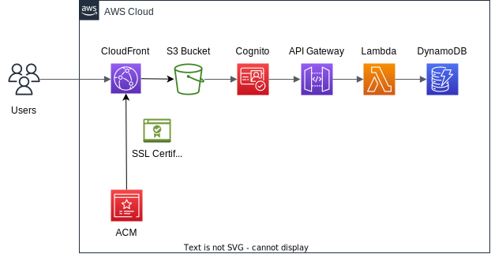

# Personal Notes App – AWS/Terraform 総合学習プロジェクト

[](https://github.com/Canale0107/tf-practice/actions/workflows/terraform.yml)

---

## プロジェクト概要

本リポジトリは「パーソナルノート/メモアプリ」を AWS インフラ（サーバーレス/モダン CI/CD）と Terraform で実践する学習用サンプルです。
主要な AWS サービスと IaC の設計・運用を、実用性ある形で段階的に習得できます。

### なぜこのプロジェクト？

- **学習効率**: 認証、ストレージ、API 設計、CI/CD など幅広く体験
- **拡張性**: ライトな MVP(最小機能)から段階拡張へ対応
- **実用性**: Markdown メモの作成・編集・検索可能

---

## システム全体アーキテクチャ



> 詳細な図の解説や拡張方針は [diagrams/note/overview.note.md](diagrams/note/overview.note.md) を参照。

---

## 機能要件（MVP & Phase2）

### MVP（最小機能）

- **ユーザー認証**: Cognito によるサインアップ/サインイン、セッション管理
- **ノート管理（CRUD）**:
  - ノート作成/一覧/詳細取得/更新/削除（API 経由）
- **UI**: シンプルな Web（HTML, CSS, JS）を S3 静的ホスティング

#### データモデル（DynamoDB）

| Key       | 用途                       |
| --------- | -------------------------- |
| userId    | Cognito ユーザー ID (Hash) |
| noteId    | ノート ID (UUID, Range)    |
| title     | タイトル                   |
| content   | 本文（Markdown）           |
| createdAt | 作成日時                   |
| updatedAt | 更新日時                   |
| tags      | タグ（配列、任意）         |

#### API エンドポイント

| メソッド | パス            | 説明           |
| -------- | --------------- | -------------- |
| GET      | /notes          | ノート一覧取得 |
| POST     | /notes          | ノート作成     |
| GET      | /notes/{noteId} | ノート詳細取得 |
| PUT      | /notes/{noteId} | ノート更新     |
| DELETE   | /notes/{noteId} | ノート削除     |

### Phase2 以降（拡張機能例）

- ノート検索（DynamoDB GSI）・タグ絞り込み
- ファイル添付・画像管理（S3,署名付き URL）
- ノート共有リンク・公開/非公開設定
- カテゴリ/フォルダ管理

---

## 利用 AWS サービス

- Cognito: ユーザー認証
- API Gateway: REST API (Cognito 認可)
- Lambda: API バックエンド
- DynamoDB: NoSQL DB (NoteTable)
- S3: 静的 Web&ファイルホスティング
- CodeBuild/CodePipeline: CI/CD

---

## ディレクトリ構成

```
tf-practice/
├── README.md
├── environments/           # dev, prod, staging別Tf構成
├── modules/                # サービス毎モジュール群
├── docs/                   # 運用/設計/提案ドキュメント
├── adr/                    # 重要設計意思決定(ADR)
├── diagrams/               # 設計図・SVG・note等
├── lambda-functions/       # Lambda用コード
└── ci-cd/                  # CI/CD構成例
```

---

## クイックスタート

- [docs/getting-started.md](docs/getting-started.md): 初期セットアップ
- [docs/deployment-guide.md](docs/deployment-guide.md): 詳細デプロイ&コスト注意
- [docs/cicd-guide.md](docs/cicd-guide.md): CI/CD 運用ガイド

### セットアップ最短例

```bash
cd environments/dev
cp terraform.tfvars.example terraform.tfvars
terraform init
terraform plan
terraform apply
```

---

## CI/CD について

- GitHub Actions を利用した自動 plan/validate。apply/destroy は手作業
- `ci-cd/.github/workflows/terraform.yml`・`ci-cd/aws/buildspec.yml` 参照

## 設計ドキュメント・背景

- [docs/project-proposal.md](docs/project-proposal.md): アイデア/要件/仕様詳細
- [docs/goal_structure_20251217.md](docs/goal_structure_20251217.md): 目標ディレクトリ構成・進捗ロードマップ
- [adr/](adr/): 主要意思決定ドキュメント
- [diagrams/](diagrams/): draw.io 構成図・svg・設計メモ
